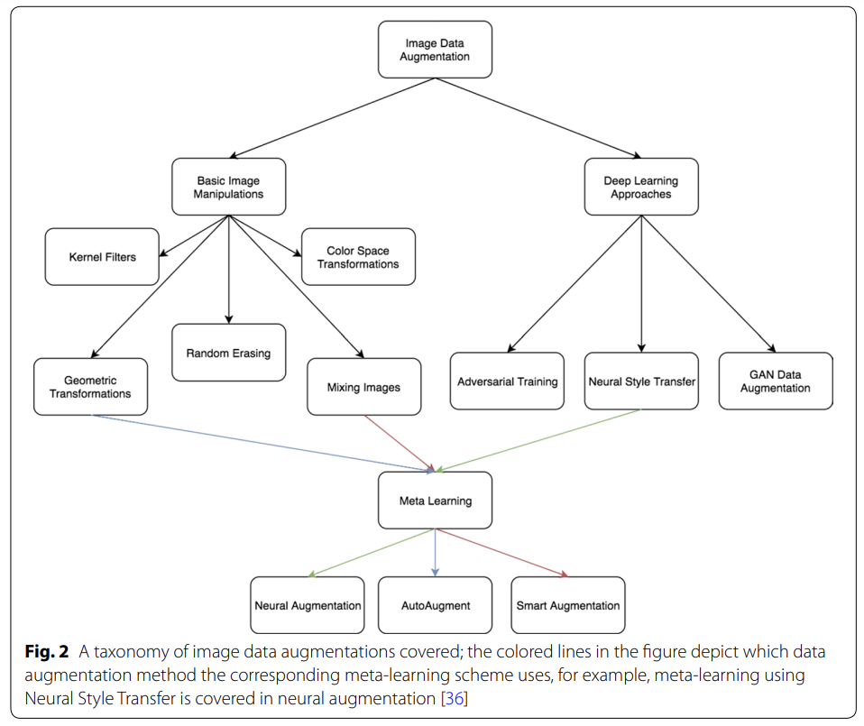

### Image Augmentation for Object Detection
- 하나의 데이터로 여러 개의 데이터를 만들어내는/데이터를 증강시키는 기법으로, Overfitting 문제 해결
- 단,Augmentation 과정에서 데이터의 본질이 흐려지지 않도록 주의해야 함
- 방법
  - 1> augmentation method
    
    - Image Data Augmentation
      - Basic Image Manipulations
        - Geometric Transformations
          - Flipping: 뒤집기 (보통 좌우반전을 많이 사용)
          - Cropping: 잘라내기
          - Rotation: 회전하기
          - Translation: 이미지를 왼쪽, 오른쪽, 위 또는 아래로 이동하기
          - Color space: R,G,B 값 조정해 데이터 새롭게 생성 가능
          - Noise Injetion: 대비를 조정하는 등 여러 가지 Noise Filter로 생성
        - Color Space Transformations: 조명 편향에 대한 솔루션으로, R, G, B 값 중 하나를 최소값 만드거나 혹은 최대값으로 맞추는 등의 조정 통해 조절 
        - Random Erasing
        - Kernel Filters: 여러가지 커널 필터 적용시켜 데이터 증강시키는 방법
          - Gaussian Filter: 이미지 흐리게 만듦
          - Edge Filter: 이미지 선명하게 만듦
          - Patch Shuffle Filter: nxn으로 특정 영역 나누어 해당 영역 픽셀들을 랜덤하게 섞음
        - Mixing images
      - Deep Learning Approaches
        - Feature Space Augmentation
        - Adversarial Training
        - Neural Style Transfer
        - GAN Data Augmentation
      - Meta Learning
        - Neural Augmentation
        - AutoAugment
        - Smart Augmentation
  - 2> augmentation method
    
    - A> Basic Image Data Augmentations
      - Image Manipulation
        - Geometric: Rotation, Translation, Shearing
        - Non-Geometric: Flipping, Cropping, Noise injection, Color Space, Jitter, Kernel
      - Image Erasing
        - Erasing: Cutout, Random, Erasing, Hide and Seek, GridMask
    - B> Advanced Data Augmentations
      - Image Mixing
        - Single Image Mixing: Local Augment, Self-Aug, SalfMix, KeepAugment, CutThumbnail
        - Multi-Images Mixing: Mixup, CutMix, SaliencyMix ...
      - Auto Augment
        - Reinforcement Learning Based: AutoAugment, Fast AutoAug ...
        - Non-Reinforcement Learning Based: RandAug, ADA ...
      - Feature Augmentation
      - Neural Style Transfer
      
- 참고 논문
  - A survey on Image Data Augmentation for Deep Learning (2019)
    - https://journalofbigdata.springeropen.com/articles/10.1186/s40537-019-0197-0
  - Image Data Augmentation Approaches: A Comprehensive Survey and Future directions
for Deep Learning (2023)
    - https://arxiv.org/abs/2301.02830

- 참고 자료
  - https://wikidocs.net/164690
  - https://deepestdocs.readthedocs.io/en/latest/003_image_processing/0030/
  - https://foreverhappiness.tistory.com/112